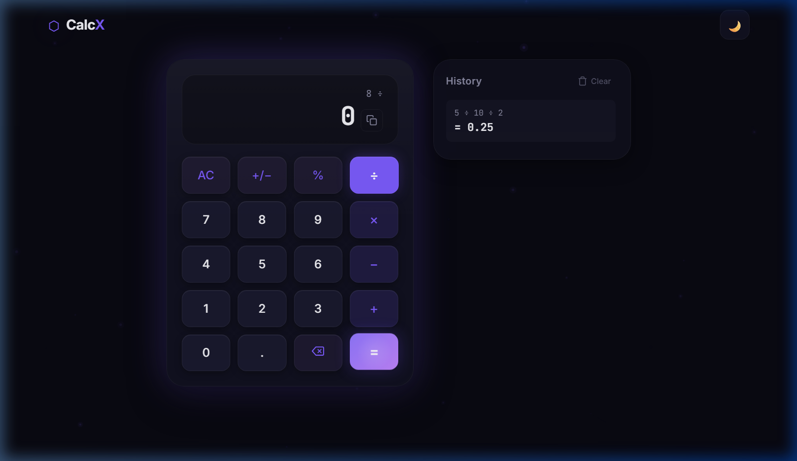
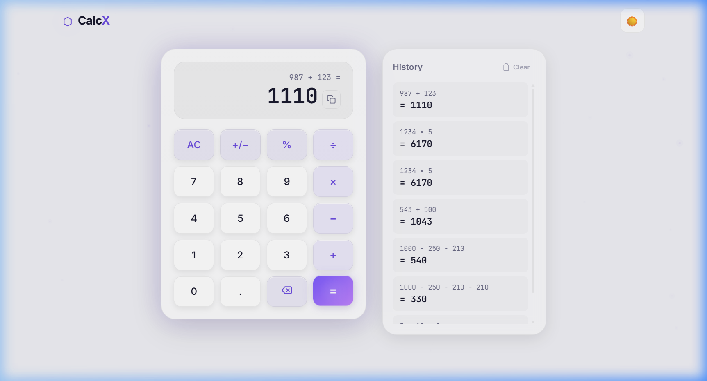

<div align="center">

# ⬡ CalcX

### A Premium, Futuristic Calculator

[](https://albin669-gif.github.io/CalcX/)
[](https://developer.mozilla.org/en-US/docs/Web/HTML)
[](https://developer.mozilla.org/en-US/docs/Web/CSS)
[](https://developer.mozilla.org/en-US/docs/Web/JavaScript)
[](LICENSE)

A sleek, production-quality calculator built with vanilla HTML, CSS, and JavaScript — featuring glassmorphism design, 3D depth effects, animated particles, calculation history, full keyboard support, and dark/light themes.

<br />



<br />



</div>

---

## ✨ Features

### 🧮 Calculator
- Full arithmetic: **+**, **−**, **×**, **÷**
- Decimal point, percentage (%), and plus/minus (+/−)
- AC (clear all) and backspace
- Proper operator precedence
- Handles negative numbers and decimal calculations
- Division by zero protection
- Long number overflow handling with adaptive font sizing

### 🎨 Design
- **Glassmorphism** — frosted-glass panels with backdrop blur
- **3D Depth** — perspective tilt on the calculator body, raised buttons with press-down animation
- **Animated Background** — floating, connected particles that pulse softly
- **Dual Themes** — dark and light mode with smooth transitions
- **Micro-Animations** — hover effects, ripple tracking, button press feedback, toast notifications
- **Premium Typography** — Inter + JetBrains Mono from Google Fonts
- **Responsive** — desktop (side-by-side layout), tablet, and mobile (stacked layout)

### 🛠️ Extras
- **Calculation History** — records all calculations, clickable to reload results, persisted in `localStorage`
- **Clear History** — one-click to wipe the history log
- **Copy Result** — clipboard copy with toast confirmation
- **Theme Persistence** — your preferred theme is saved across sessions
- **Full Keyboard Support** — see table below

---

## ⌨️ Keyboard Shortcuts

| Key | Action |
|---|---|
| `0` – `9` | Input digits |
| `+` `-` `*` `/` | Operators |
| `.` | Decimal point |
| `%` | Percentage |
| `Enter` or `=` | Evaluate |
| `Escape` | Clear (AC) |
| `Backspace` | Delete last digit |

---

## 🚀 Live Demo

👉 **[https://albin669-gif.github.io/CalcX/](https://albin669-gif.github.io/CalcX/)**

---

## 📂 Project Structure

```
CalcX/
├── index.html          # Semantic HTML structure
├── style.css           # Full styling with CSS custom properties
├── script.js           # Calculator logic, history, keyboard, animations
├── screenshots/
│   ├── dark-mode.png   # Dark theme screenshot
│   └── light-mode.png  # Light theme screenshot
└── README.md
```

---

## 🏗️ Run Locally

No build tools or dependencies required — just open the file:

```bash
# Clone the repository
git clone https://github.com/albin669-gif/CalcX.git

# Open in your browser
open CalcX/index.html
# or on Windows:
start CalcX/index.html
```

---

## 🧰 Tech Stack

| Technology | Purpose |
|---|---|
| **HTML5** | Semantic structure & accessibility |
| **CSS3** | Custom properties, glassmorphism, 3D transforms, responsive grid |
| **Vanilla JS** | Calculator engine, DOM updates, Canvas animations, localStorage |
| **Google Fonts** | Inter (UI) + JetBrains Mono (display) |

---

## 📜 License

This project is open source and available under the [MIT License](LICENSE).

---

<div align="center">

**Built with ❤️ by [Albin Biju](https://github.com/albin669-gif)**

</div>
